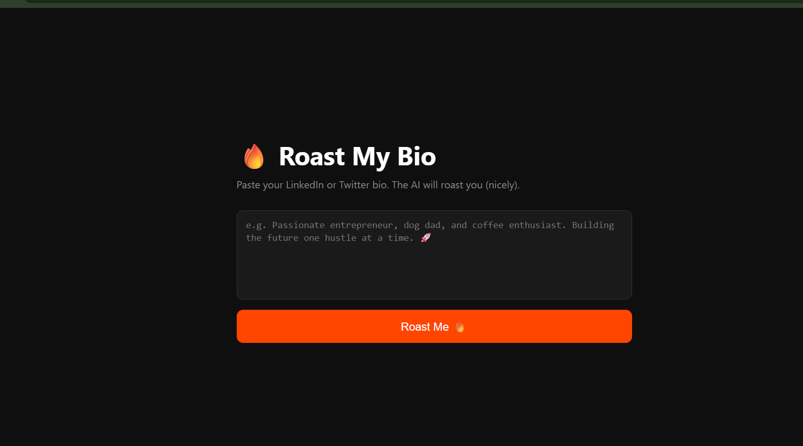
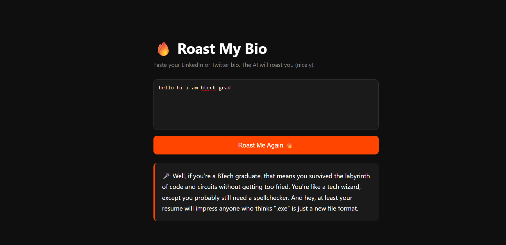
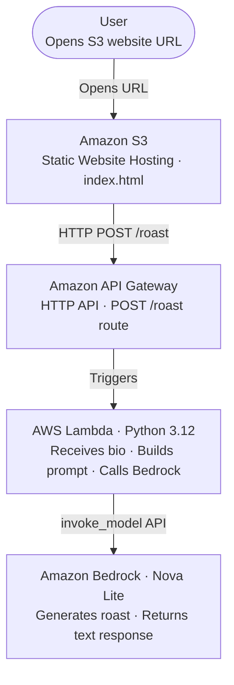

# 🔥 Roast My Bio

An AI-powered web app that roasts your LinkedIn or Twitter bio in 3 funny sentences — built entirely on AWS serverless.

## Live Demo

[Click here to try it]([https://builder.aws.com/content/3HtHa7RuikJRz53cKv6Fe5Ro5b9/weekend-creative-challenge-roast-my-bio])

---

## Screenshots

### Paste your bio


### Get roasted


---

## What It Does

- Paste your LinkedIn or Twitter bio
- Click "Roast Me"
- Get a savage 3-sentence AI roast instantly — no login, no setup

---

## Architecture



---

## AWS Services Used

| Service | Role | Free Tier |
|---|---|---|
| **Amazon S3** | Hosts the static frontend (HTML, CSS, JS) | 5GB storage, 20K GET requests/month |
| **Amazon API Gateway** | Exposes a single POST /roast HTTP endpoint | 1M API calls/month for 12 months |
| **AWS Lambda** | Runs the Python backend — builds the prompt, calls Bedrock, returns the roast | 1M requests/month, 400K GB-seconds compute |
| **Amazon Bedrock (Nova Lite)** | The AI model that generates the roast | Pay per token — roughly $0.00006 per roast |

**Estimated cost for 1,000 roasts: under $0.10**

---

## Why Serverless

- No EC2, no servers, nothing to patch or manage
- Scales from 1 user to 10,000 with zero config changes
- You only pay when someone actually clicks "Roast Me"
- Entire stack deployable in under 2 hours

---

## How To Deploy

### 1. Enable Bedrock Model Access

- Go to **AWS Console → Bedrock → Model Access**
- Request access to **Nova Lite**
- Wait for approval (usually instant)

### 2. Create the Lambda Function

- Runtime: **Python 3.12**
- Paste code from `lambda/lambda_function.py`
- Set timeout to **30 seconds** (Bedrock can be slow)
- Attach IAM policy: `AmazonBedrockFullAccess`

### 3. Set Up API Gateway

- Create an **HTTP API**
- Add route: `POST /roast`
- Integration: point to your Lambda function
- Enable **CORS** (origin: your S3 URL)
- Deploy to a stage (e.g. `prod`)

### 4. Deploy the Frontend to S3

- Create an S3 bucket (name it anything)
- Enable **Static Website Hosting**
- Upload `index.html`
- Add this bucket policy to make it public:

```json
{
  "Version": "2012-10-17",
  "Statement": [
    {
      "Effect": "Allow",
      "Principal": "*",
      "Action": "s3:GetObject",
      "Resource": "arn:aws:s3:::YOUR-BUCKET-NAME/*"
    }
  ]
}
```

- Paste your API Gateway URL into `index.html` where it says `YOUR_API_URL`

---

## IAM Permissions Required

| Permission | Why |
|---|---|
| `AmazonBedrockFullAccess` | Lambda needs this to call Nova Lite |
| S3 public bucket policy | Users need to load the HTML file |
| API Gateway → Lambda invoke | Auto-configured when you set the integration |

---

## Local Setup

None needed. This runs entirely on AWS — open the S3 URL and it works.

---

## Author

Built for the **AWS Creative App Weekend Challenge 2026**
